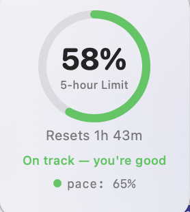
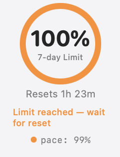
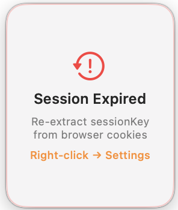

# Claude Usage Mac Widget

A lightweight macOS desktop widget that shows your Claude usage in real time — with pace tracking and reset countdown.

<p align="center">
  
  &nbsp;&nbsp;&nbsp;
  
  &nbsp;&nbsp;&nbsp;
  
</p>

<p align="center">
  
  
  
  
</p>

---

## Why This Exists

Claude usage limits are easy to hit without noticing. This widget keeps the important signals visible at all times:

- **Current usage** percentage
- **Pace** vs time elapsed
- **Reset countdown** timer
- **Clear status color** (green / orange / red)

No tab switching. No guesswork.

---

## Features

<table>
<tr>
<td width="33%">


</td>
<td width="33%">


</td>
<td width="33%">


</td>
</tr>
<tr>
<td align="center"><em>On track — plenty of room</em></td>
<td align="center"><em>Limit reached — wait for reset</em></td>
<td align="center"><em>Session expired — re-authenticate</em></td>
</tr>
</table>

- **Live progress ring** with usage %
- **Pace tracking** — actual vs expected usage
- **Reset countdown** timer
- **Always-on-top** floating panel (all Spaces)
- **Draggable** — remembers position
- **Auto-refresh** every 30 seconds
- **Session expiry detection** with red border alert
- **Cloudflare-aware** — won't falsely show "Session Expired"
- **Plain-English status** messages
- **Minimal**, translucent macOS-native UI

---

## Quick Start (2 Minutes)

### Requirements

- macOS 13+
- Xcode Command Line Tools
  ```bash
  xcode-select --install
  ```

### 1. Clone & Build

```bash
git clone https://github.com/rishiatlan/Claude-Usage-Mac-Widget.git
cd Claude-Usage-Mac-Widget
chmod +x build.sh run.sh setup.sh generate-icon.sh
./build.sh
```

### 2. Setup Credentials

```bash
./setup.sh
```

The setup script will:

1. Prompt for your **session key** (masked input — never shown on screen)
2. **Automatically fetch** your Organization ID from the API
3. **Validate** credentials with a test call and show current usage
4. Save configuration and offer to launch the widget

> **Session key expired?** Just run `./setup.sh` again. Your org ID is remembered — you only re-paste the session key.

### 3. Launch

```bash
open build/ClaudeUsage.app
```

That's it. The widget appears on your desktop with live data.

---

## Usage

| Action | How |
|--------|------|
| Open Settings | Right-click → **Settings** |
| Refresh | Right-click → **Refresh** |
| Quit | Right-click → **Quit** |
| Move widget | Click + drag |
| Change metric | Settings → **Display Metric** |

### Choosing a Metric

| Metric | Best For |
|--------|----------|
| **5-Hour** (Recommended) | Daily pacing — tells you if you can keep chatting right now |
| **7-Day (All Models)** | Weekly budgeting — tracks total weekly allowance |
| **7-Day (Sonnet Only)** | Heavy Sonnet usage tracking |

---

## How to Get Your Credentials

`setup.sh` handles this automatically, but if you need to grab them manually:

### Session Key

1. Open **[claude.ai](https://claude.ai)** in Chrome or Safari (logged in)
2. Open Developer Tools — **`Cmd + Option + I`**
3. Go to **Application** tab (Chrome) or **Storage** tab (Safari)
4. Expand **Cookies** → click **https://claude.ai**
5. Find the row named **`sessionKey`** → copy the full value

> **Note:** Session keys expire periodically (when your browser session refreshes). When this happens, the widget will show a **red "Session Expired"** border. Just re-run `./setup.sh` or paste a fresh key in Settings.

### Organization ID

1. Still in DevTools, switch to the **Network** tab
2. Send any message in a Claude chat
3. Find any request URL containing `/organizations/` — the UUID after it is your org ID

> **Note:** Org IDs **never expire**. You only need to grab this once. `setup.sh` fetches it automatically from the API.

---

## Security & Privacy

| Principle | Detail |
|-----------|--------|
| **No browser access** | `setup.sh` never reads cookies, Keychain, or browser data — you paste the key yourself |
| **Masked input** | Session key entry is hidden (`read -s`) and never echoed or logged |
| **Local only** | Credentials saved to macOS UserDefaults on your machine — nothing leaves your computer |
| **No telemetry** | Zero analytics, zero tracking. Only talks to `claude.ai/api` |
| **Cloudflare-aware** | Detects Cloudflare challenge pages and handles them gracefully — won't falsely report session expiry |
| **Smart polling** | Pauses API calls when session expires — resumes when you save fresh credentials |
| **Open source** | Read every line of `setup.sh` and `ClaudeUsageApp.swift` |

---

<details>
<summary><strong>Understanding Claude Limits</strong></summary>

<br>

Claude enforces two independent limits:

### 5-Hour Rolling Window

- Tracks the last 5 hours of usage
- Recovers automatically as time passes
- Most useful for daily pacing
- If it hits 100% — you're locked out until older messages age past the 5-hour mark

### 7-Day Weekly Limit

- Total weekly allowance across all models
- Hard reset once per week
- If it hits 100% — you're done until the weekly reset regardless of the 5-hour limit

There's also a **7-Day Sonnet-only** metric for tracking that model separately.

### Status Colors (Pace Tracking)

The widget compares your actual usage vs expected usage based on elapsed time:

| Color | Meaning | Example |
|-------|---------|---------|
| 🟢 Green | More than 5% **below** expected pace | 2h into 5h window, at 30% (expected: 40%) |
| 🟠 Orange | Within **±5%** of expected pace | 2h into 5h window, at 38% (expected: 40%) |
| 🔴 Red | More than 5% **above** expected pace | 2h into 5h window, at 60% (expected: 40%) |

### Status Messages

| Message | Meaning |
|---------|---------|
| Plenty of room | Under 30%, on track |
| On track — you're good | On track, above 30% |
| On pace — be mindful | Roughly at expected pace |
| Above pace — slow down | Burning faster than expected |
| Almost out — slow down | Above 90%, exceeding pace |
| Limit reached — wait for reset | 100% — rate-limited |

</details>

---

<details>
<summary><strong>What Happens When setup.sh Can't Auto-Fetch</strong></summary>

<br>

Sometimes `setup.sh` can't automatically fetch your org ID. Here's why and what to do:

### Cloudflare Blocks

The Claude API sits behind Cloudflare, which occasionally challenges `curl` requests with a 403 page. **This does NOT mean your session key is invalid.**

- `setup.sh` will detect the Cloudflare block and tell you
- It will ask you to enter your org ID manually instead (with step-by-step instructions)
- The widget app itself uses macOS `URLSession` which passes through Cloudflare — so the widget will work fine even if `curl` was blocked

### Expired Session Key

If the session key you pasted has already expired:

- `setup.sh` will detect the 401/403 error and tell you it's expired
- You'll be prompted to paste a fresh key and try again
- If it still fails, you can save anyway — the widget will show "Session Expired" and prompt you to update later

### Network Issues

If your network is down or the API is unreachable:

- `setup.sh` offers manual entry as a fallback
- The widget retries with exponential backoff (1s → 2s → 4s) up to 3 times

</details>

---

<details>
<summary><strong>Manual Setup (Alternative to setup.sh)</strong></summary>

<br>

If you prefer not to use the setup script:

1. **Right-click** the widget → **Settings...**
2. Paste your **Session Key** (from browser cookies — see [How to Get Your Credentials](#how-to-get-your-credentials))
3. Paste your **Organization ID** (from DevTools Network tab, or env var)
4. Select which metric to display
5. Click **Save**

### Environment Variable Fallback

```bash
export CLAUDE_SESSION_KEY="sk-ant-sid01-..."
export CLAUDE_ORGANIZATION_ID="xxxxxxxx-xxxx-xxxx-xxxx-xxxxxxxxxxxx"
open build/ClaudeUsage.app
```

</details>

---

<details>
<summary><strong>How It Works (Technical)</strong></summary>

<br>

The widget polls the Claude API every 30 seconds:

```
GET https://claude.ai/api/organizations/{orgId}/usage
Cookie: sessionKey={key}
User-Agent: Mozilla/5.0 (Macintosh; Intel Mac OS X 10_15_7) ClaudeUsageWidget/1.0
```

**Architecture:** Single-file Swift app (`ClaudeUsageApp.swift`, ~1420 lines) — no Xcode project, no dependencies, no package manager. Compiles with `swiftc` directly.

**Key components:**
- `FloatingWidgetPanel` — borderless `NSPanel` (always-on-top, all Spaces, draggable)
- `WidgetView` — SwiftUI with 4 states: data, setup needed, session expired, loading
- `WidgetPanelController` — manages lifecycle, persists position
- `AppDelegate` — fetching, 30s timer, retry logic, Cloudflare detection

</details>

---

## Troubleshooting

| Issue | Fix |
|-------|-----|
| **"Setup Needed"** | Run `./setup.sh` or right-click → Settings → enter credentials |
| **"Session Expired"** (red border) | Re-run `./setup.sh` with a fresh session key. Org ID is remembered. |
| **Widget not visible** | App runs as background process. Check Activity Monitor → relaunch with `open build/ClaudeUsage.app` |
| **Data not loading** | Likely authentication — re-run `./setup.sh` |
| **Stuck at same %** | That's accurate — 5-hour recovers gradually, 7-day resets weekly. Try switching metrics. |
| **`setup.sh` says "Cloudflare blocked"** | Normal. Enter org ID manually when prompted. Widget app is unaffected. |
| **Build fails (SwiftBridging)** | `sudo rm -rf /Library/Developer/CommandLineTools && xcode-select --install` |
| **Widget gone after restart** | Launch at Login is enabled by default. If you disabled it, re-enable via right-click → Settings |

---

## Roadmap

- [ ] Menu bar mode
- [x] Launch at Login — enabled by default via `SMAppService`, toggleable in Settings
- [x] In-app update notifications — blue dot indicator + one-click self-update via Settings
- [ ] Optional usage history graph
- [ ] Signed / notarized build
- [ ] Homebrew formula

---

## Credits

Built on top of [claude-usage](https://github.com/amoga-org/claude-usage) by **[amoga.io](https://amoga.io)**. Desktop widget adaptation by [@rishiatlan](https://github.com/rishiatlan).

## License

MIT
